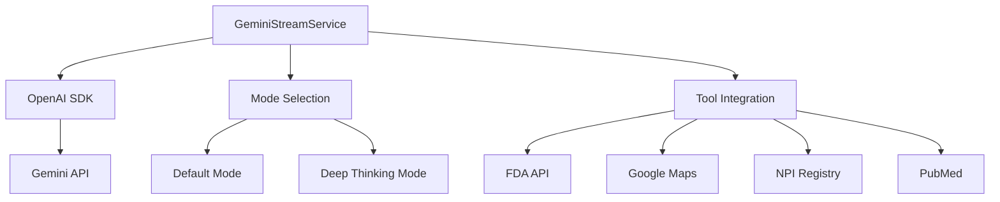

# Gemini Integration

This project implements the Gemini model integration using the OpenAI SDK, with support for both default and deep thinking modes, along with various tool integrations.

## Features

- **Gemini Model Integration**
  - Default Mode:
    - gemini-2.0-flash (complex queries)
    - gemini-2.0-flash-lite (simple text)
    - gemini-2.0-pro-exp-02-05 (large context)
  - Deep Thinking Mode:
    - gemini-2.0-flash-thinking-exp-01-21

- **Tool Integrations**
  - FDA API (drug labels, devices, NDC, recalls)
  - Google Maps (healthcare facilities, distance calculations)
  - NPI Registry (provider/facility search)
  - PubMed (article search, citations)

- **Streaming Support**
  - Real-time token delivery
  - Tool call handling
  - Error recovery
  - Connection management

## Setup

1. Clone the repository
2. Install dependencies:

   ```bash
   npm install
   ```

3. Copy the environment example file:
   ```bash
   cp .env.example .env
   ```

4. Configure your environment variables in `.env`:
   ```
   GEMINI_API_KEY=your_gemini_api_key_here
   FDA_API_KEY=your_fda_api_key_here
   GOOGLE_MAPS_API_KEY=your_google_maps_api_key_here
   PUBMED_API_KEY=your_pubmed_api_key_here
   ```

## Usage

### Basic Streaming

```typescript
import { useGeminiStream, toolDefinitions } from './hooks/useGeminiStream';

function ChatComponent() {
  const { startStream, isStreaming, error } = useGeminiStream('default');
  const [messages, setMessages] = useState<string[]>([]);

  const handleSend = async (content: string) => {
    let currentMessage = '';
    
    await startStream(
      content,
      (token) => {
        currentMessage += token;
        setMessages(prev => [
          ...prev.slice(0, -1),
          currentMessage
        ]);
      },
      Object.values(toolDefinitions)
    );
  };

  return (
    <div>
      {messages.map((msg, i) => (
        <div key={i}>{msg}</div>
      ))}
      {isStreaming && <LoadingIndicator />}
      {error && <ErrorMessage error={error} />}
    </div>
  );
}
```

### Deep Thinking Mode

```typescript
const { startStream } = useGeminiStream('deep-thinking');

// Deep thinking mode with code execution
await startStream(
  'Analyze this dataset and create visualizations...',
  (token) => {
    // Handle streaming tokens
  }
);
```

## Tool Integration Examples

### FDA API
```typescript
// Search drug labels
const result = await startStream(
  'What are the side effects of ibuprofen?',
  handleToken,
  [fdaToolDefinitions.drugLabel]
);
```

### Google Maps
```typescript
// Search healthcare facilities
const result = await startStream(
  'Find hospitals near Denver',
  handleToken,
  [mapsToolDefinitions.facilitySearch]
);
```

### NPI Registry
```typescript
// Search healthcare providers
const result = await startStream(
  'Find cardiologists in Boston',
  handleToken,
  [npiToolDefinitions.providerSearch]
);
```

### PubMed
```typescript
// Search medical research
const result = await startStream(
  'Find recent clinical trials about COVID-19 vaccines',
  handleToken,
  [pubmedToolDefinitions.articleSearch]
);
```

## Architecture



## Error Handling

The implementation includes comprehensive error handling:

- Network errors
- API rate limits
- Token validation
- Tool execution errors
- Connection management

## Contributing

1. Fork the repository
2. Create your feature branch
3. Commit your changes
4. Push to the branch
5. Create a new Pull Request

## License

This project is licensed under the MIT License - see the LICENSE file for details.
